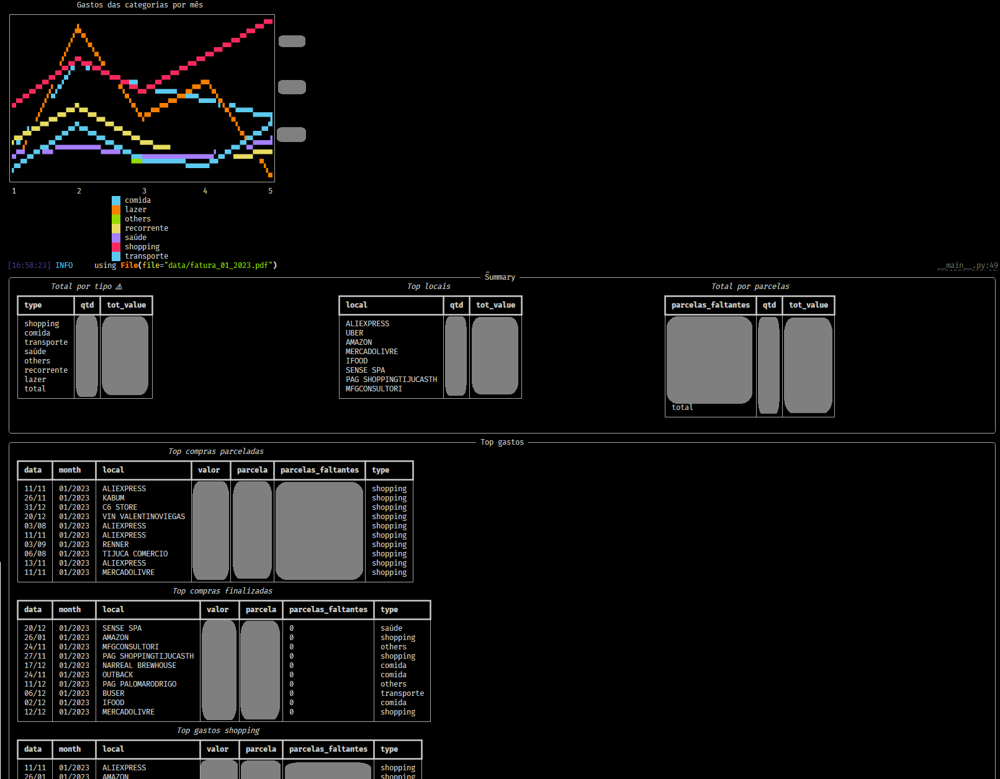

# c6_credit_card

Explore credit card bills from C6 in terminal.

## Setup and Installation

This project now uses [UV](https://github.com/astral-sh/uv) for package management and execution.

1.  **Install UV:**
    Follow the instructions on the [official UV installation guide](https://github.com/astral-sh/uv#installation).

2.  **Create a Virtual Environment (Recommended):**
    ```sh
    python -m venv .venv
    source .venv/bin/activate  # On Windows use `.venv\Scripts\activate`
    ```

3.  **Install Dependencies:**
    Once UV is installed and your virtual environment is active, install the project and its dependencies:
    ```sh
    uv pip install -e .[dev]
    ```
    This installs the package in editable mode (`-e`) along with the development dependencies (`[dev]`).

## Usage

After installation, you can run the application using the script defined in `pyproject.toml`:

To see the help message:
```sh
c6_credit_card --help
```
Or using `uv run`:
```sh
uv run c6_credit_card --help
```

To process bills from a specific folder (e.g., `data/`):
```sh
c6_credit_card -p data/
```
Or using `uv run`:
```sh
uv run c6_credit_card -p data/
```


